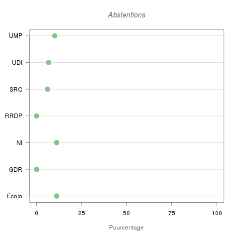

# Vote projet de loi relatif au renseignement en graphiques

## Où trouver les données ?

[Site de l'assemblée nationale](http://www2.assemblee-nationale.fr/scrutins/detail/%28legislature%29/14/%28num%29/1109)

## Légende

| Nom court | Nom complet                                            |
|-----------|--------------------------------------------------------|
| NI        | Non inscrits                                           |
| UMP       | Groupe de l'union pour un mouvement populaire          |
| RRDP      | Groupe radical, républicain, démocrate et progressiste |
| Écolo     | Groupe écologiste                                      |
| UDI       | Groupe de l'union des démocrates et indépendants       |
| SRC       | Groupe socialiste, républicain et citoyen              |
| GDR       | Groupe de la gauche démocrate et républicaine          |

## Votes par groupe en un coup d'oeil

Sur le graphique ci-dessus on se rend bien compte de l'importance des deux
plus grands groupes, l'UMP et le SRC. Mais ils totalisent tellement de voix à
eux deux qu'il est difficile de *lire* les autres groupes. Le graphique
suivant utilise un *log plus 1* sur les votes pour offrir un autre point de
vue:

Un autre point de vue intéressant est le vote en pourcentage, à l'intérieur de
chaque groupe:

## Résultats du vote sous forme de tableau

Les graphiques c'est bien, les données brutes aussi:

### Résultat en nombre de voix

|            | Écolo | GDR | NI | RRDP | SRC | UDI | UMP |
|------------|------:|----:|---:|-----:|----:|----:|----:|
| Abstention |     2 |   0 |  1 |    0 |  17 |   2 |  20 |
| Contre     |    11 |  12 |  7 |    0 |  10 |  11 |  35 |
| Pour       |     5 |   3 |  1 |   17 | 252 |  17 | 143 |

### Résultat en pourcentage par groupe

|            | Écolo | GDR | NI | RRDP | SRC | UDI | UMP |
|------------|------:|----:|---:|-----:|----:|----:|----:|
| Abstention |    11 |   0 | 11 |    0 |   6 |   7 |  10 |
| Contre     |    61 |  80 | 78 |    0 |   4 |  37 |  18 |
| Pour       |    28 |  20 | 11 |  100 |  90 |  57 |  72 |

La somme par groupe peut-être légèrement différente de 100%, ceci est du aux
arrondis.

## Nombre de voix pour chaque groupe

## Graphiques à points

Il y a peu d'abstentions, apparemment ce vote n'a pas laissé indifférent:

On voit deux groupes. NI, GDR et Écolo qui ont plutôt voté contre, et 
UMP, SRC et RRDP qui ont très peu voté contre:

Complément du graphique précédent, on voit que NI, GDR et Écolo ont peu voté
pour, et que UMP, SRC et RRDP ont beaucoup (massivement ?) voté pour:

Dans ce résumé, on retrouve bien les deux groupes:

## License

**CC BY-NC-SA 4.0**

Creative Commons Attribution-NonCommercial-ShareAlike 4.0 International

https://creativecommons.org/licenses/by-nc-sa/4.0/

## Questions and/or Comments

Feel free to email [Xavier Nayrac](mailto:xavier.nayrac@gmail.com) with any
questions, or contact me on [twitter](https://twitter.com/lkdjiin).
